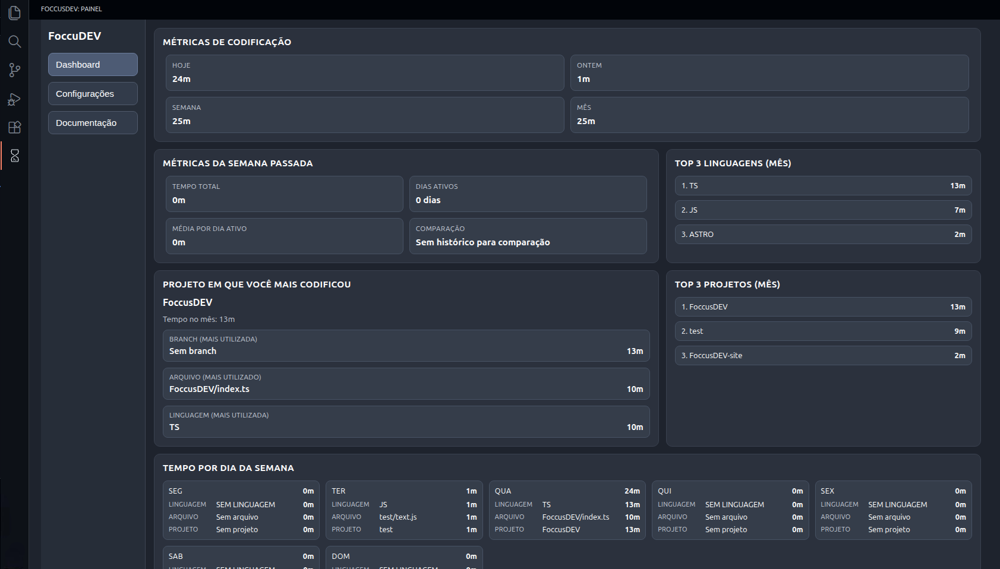

# FoccusDEV

[Versão em português](README.md) | [Official Website](https://www.foccusdev.xyz/)

FoccusDEV is a VS Code extension that tracks your coding activity and shows productivity metrics in a local dashboard.



## Features

- Dashboard with coding time for today, yesterday, week, and month.
- Comparison with the previous week.
- Top languages and top projects.
- Weekday view with details by language, file, and project.
- Local database size limit control (15 MB to 100 MB).
- Full local data cleanup directly from the interface.
- Status bar shortcut to open the dashboard.

## How to Install

### Via VS Code Marketplace

1. Open VS Code and press `Ctrl+P` (Quick Open).
2. Paste the following command and press Enter:
   ```bash
   ext install gustavo-2514.foccusdev
   ```

Or access directly: [Visual Studio Marketplace](https://marketplace.visualstudio.com/items?itemName=gustavo-2514.foccusdev)

### Via Open VSX

If you use Cursor, Antigravity, VSCodium, or another open-source version:

[Open VSX Registry](https://open-vsx.org/extension/gustavo-2514/foccusdev)

## How to use

1. Install the extension.
2. Open the sidebar and click **FoccusDEV**.
3. Navigate through the tabs:
   - **Dashboard**: coding metrics.
   - **Settings**: local database limit and data cleanup.
   - **Documentation**: repository link.

You can also open the dashboard with the command:

- `FoccusDEV: Abrir Painel`

## Storage and privacy

- 100% local extension, data is saved locally in the extension global storage.
- The extension does not send data to external servers.
- The delete option removes all local history. (Be sure before deleting)

## Requirements

- VS Code `^1.100.0`

## Contributions

Contributions are welcome.

1. Fork the repository.
2. Create a branch for your change.
3. Commit with a clear message.
4. Open a Pull Request describing the change.

## Repository

- Source code and issues: <https://github.com/Gustavo-2514/foccusdev-extension>

## Changelog

Extension changes are documented in `CHANGELOG.md`.
